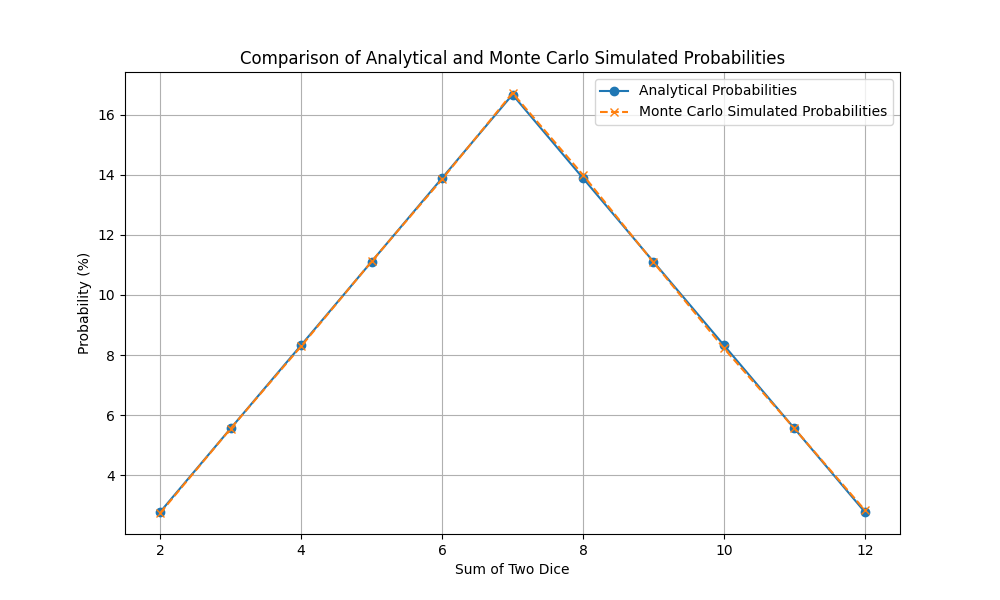

## Аналітичні та змоделювані методом Монте-Карло ймовірності

|   Sum |   Analytical (%) |   Monte Carlo (%) |
|------:|-----------------:|------------------:|
|     2 |             2.78 |             2.699 |
|     3 |             5.56 |             5.431 |
|     4 |             8.33 |             8.319 |
|     5 |            11.11 |            11.076 |
|     6 |            13.89 |            14.046 |
|     7 |            16.67 |            16.77  |
|     8 |            13.89 |            13.842 |
|     9 |            11.11 |            11.217 |
|    10 |             8.33 |             8.332 |
|    11 |             5.56 |             5.524 |
|    12 |             2.78 |             2.744 |

## Висновки
Порівнюючи аналітичні ймовірності та ймовірності, отримані методом Монте-Карло, можна помітити, що результати досить близькі, що підтверджує правильність обчислень. Невеликі відхилення є результатом випадковості симуляції, але з більшим числом симуляцій ці відхилення стають ще меншими.

## Демонстрація графіка

